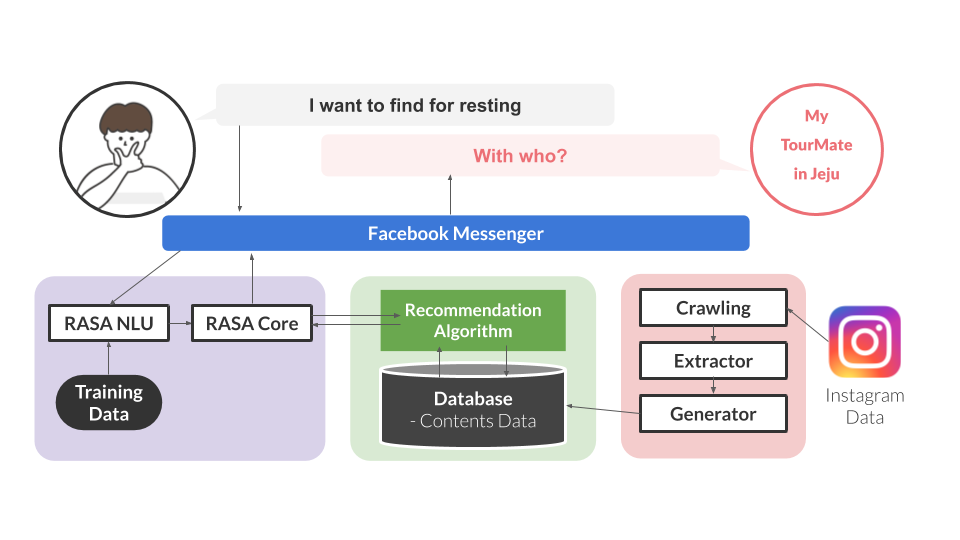
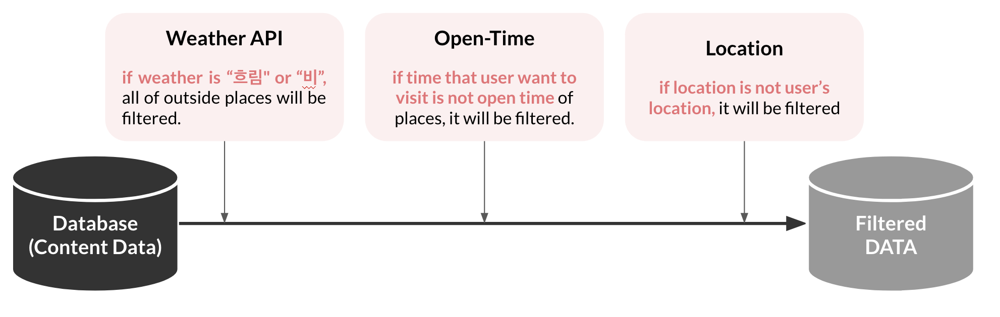

# MyTourMate
본 프로젝트는 KAIST CS408 수업의 과제 용도로 제작되었습니다.
작성자 : 김세연(KAIST, 전산학부) 최승호(KAIST, 전산학부) 

 

## 개발 환경
Chatbot Training Tool : RASA

Server Platform : heroku

anaconda, python 3.6.9

 

## 프로젝트 개요

MyTourMate는 여행객에게 맞춤형 관광 정보를 제공하여 여행에 대한 니즈 해소를 목표로 제작된 여행 가이드 챗봇 시스템입니다. 여행객들이 필요로 하는 여행 정보의 부재 문제와 이를 해소하기 위해 요구되어지는 사항들에 대해 분석을 진행하였고, 이를 토대로 챗봇 시스템 기반의 여행 가이드 서비스 “My Tour-Mate”를 설계 및 구현하였습니다. 현재 페이스북 메신저로 연동이 되어있고, 메신저는 비공개용 상태입니다. 

Software Design Document와 최종 발표 프레젠테이션을 확인하고 싶으면 아래의 링크로 확인할 수 있습니다.

- Software Design Document : [bit.ly/tourmate_doc](http://bit.ly/tourmate_doc)
- Final Presentation : [bit.ly/tourmate_ppt](http://bit.ly/tourmate_ppt)

 

### 프로젝트 System Architecture

 

### 맞춤형 여행 정보 제공을 위한 Database 설계

맞춤형 정보 제공한 content 수집을 위해 instaloader를 이용하여 instagram 포스트들을 크롤링하였고, 이를 Google Natural Language API와 Google Vision API를 이용하여 분석하였습니다. 분석한 내용에 bs4를 이용하여 Naver 정보를 크롤링하거나 직접 찾아 컨텐츠 데이터를 수집하였습니다. 해당 관련 코드는 MyTourMate/contents_data 폴더 안에서 확인할 수 있습니다.

- content 데이터에 대해 분석하면서 제작한 가이드 문서는 [bit.ly/tourmate_filtering](http://bit.ly/tourmate_filtering)에서 확인할 수 있습니다.
- Google Natural Language API를 사용하면서 필요하다고 생각되는 부분에 대해 따로 정리해놓은 문서는 [bit.ly/tourmate_api](http://bit.ly/tourmate_api)에서 확인할 수 있습니다.

이에 맞춰 데이터 베이스 상에서 총 name(장소 이름),activity(가능한 홀동),location(위치),intimacy(함께 방문한 사람),time(오픈 시간),kewyords(추천 문구),pic(대표 이미지),url(홈페이지 주소),inout(실내/외 여부)의 column에 맞춰 각 content 데이터를 정리하였습니다. 참고할 수 있게 데이터 베이스 상에 있는 데이터 일부를 추가적으로 MyTourMate/action_dir 내부의 contentData.csv에 공유하였습니다.

  

### Korean Tokenizer

저희 프로젝트에서 중요하게 쓰이는 Mecab을 이용한 Korean Tokenizer는 이영준 조교님(KAIST)이 제작하셨고, 그 위에 이현배(KAIST)님이 수정해주셨습니다.

 

### RASA Train
저희는 RASA를 트레이닝 하기 위해 기존에 진행한 사용자 설문조사를 바탕으로 총 12개의 스토리를 제작하였습니다. 또한, 39개의 intent(사용자 의도 분석)와 8개의 entity type(사용자 정보)를 설계하였고 이를 위해 약 1000개 가량의 트레이닝 문장 데이터를 생성하였습니다. 해당 부분은 MyTourMate/webhook_dir/data에서 확인할 수 있습니다.

 

### Recommendation Algorithm

정보 제공을 위해 우선적으로 날씨 정보와 해당 장소의 open time을 비교하여 맞지 않는 정보에 대해 필터링을 진행하였습니다. 또한 사용자가 방문하고자 하는 장소에 맞게 데이터 베이스에서 데이터를 추출할 수 있도록 하였습니다. 그리고 데이터 베이스 상의 콜롬과 사용자 정보(entity)의 일치 정도에 따라 scoring하였고 이에 맞춰 가장 점수가 높은 상위 5개의 content를 사용자에게 보여주었습니다. 자세한 내용은 앞서 링크 걸어둔 Final Presentation을 확인하면 확인할 수 있습니다.

 

## How to run

### 1. local(cmd)

**가상 환경 구축 방법 (anaconda 이용)**

cmd창에서 python3.6.9 가상 환경을 생성하고, 생성한 가상 환경을 실행시킵니다.

    conda create -n (가상환경이름) python=3.6.9
    conda activate (가상환경이름)

 

**Rasa 실행 환경 구축**

생성된 가상 환경 위에서 실행을 위한 라이브러리를 설치해줍니다.

    pip install rasa[spacy]==1.3.9
    python -m spacy download en_core_web_md
    python -m spacy link en_core_web_md en

 

**KoreanTokenizer 설치**

MyTourMate/webhook_dir에 rasa_korean.py 파일을 가상 환경 내 rasa 라이브러리에 설치합니다. 

Mac환경 기준으로 opt/anaconda/envs/(본인이 설정한 가상 환경)/lib/python3.6/site-packages/rasa/nlu/tokenizers에 rasa_korean.py파일을 넣어줍니다.

opt/anaconda/envs/(본인이 설정한 가상 환경)/lib/python3.6/site-packages/rasa/nlu에 [register.py](http://register.py)에서 아래와 같이 코드를 넣어줍니다. 

    from rasa_nlu.tokenizers.korean_tokenizer import KoreanTokenizer
    ...
    
    component_classes= {
    	...
    	KoreanTokenizer,
    	...
    }

 

**action local 서버 실행**

cmd창에서 MyTourMate/action_dir로 들어가서 아래와 같은 명령어를 실행합니다. 

    rasa run actions

 

**MyTourMate 실행**

cmd창에서 MyTourMate/webhook_dir로 들어가서 아래와 같은 명령어를 실행합니다.

    rasa shell

 

### 2. heroku server + Facebook Messenger 연동

총 2개의 서버(action, webhook)이 필요합니다. 각 서버에는 aciton_dir과 webhook_dir이 업로드됩니다.

 

**Endpoint 변경**

MyTourMate/webhook_dir/endpoints.yml에서 action_endpoint부분의 url: "[http://localhost:5055/webhook](http://localhost:5055/webhook)"을 주석 처리하고 url에 본인의 헤로쿠 서버의 액션 webhook url을 작성해줍니다. 

    action_endpoint:
     url: "https://tourmate-jeju-actions.herokuapp.com/webhook"
    # url: "http://localhost:5055/webhook"

 

**Messenger 연동**

MyTourMate/webhook_dir/credential.yml에서 주석 처리된 facebook의 주석을 해제하고 원하는 verify 토큰을 설정합니다. 또한, facebook developer에서 생성한 messenger 토큰을 입력합니다.

    facebook:
      verify: #원하는 문자열
      secret: #페이스북 앱 시크릿 코드 작성
      page-access-token: #페이스북 메신저 토큰

 

**heroku 업로드**

생성한 헤로쿠의 webhook 서버와 action서버에 각각 webhook_dir과 action_dir을 업로드 시켜줍니다. 파일 내부에 runtime.txt와 Procfile이 있기 때문에 따로 설정해줄 필요는 없습니다.

 

## Code Guide

### action_dir/action.py
webhook에서 요청이 들어오는 action들을 처리하는 함수들이 포함된 곳입니다. 
총 7개의 action 함수가 있으며 이를 보조하는 ?개의 보조 함수가 있습니다.

 

**ActionSetAge**
story 상에서 action_set_age가 요청될 때 실행되는 함수입니다. 사용자와의 대화에서 나이에 대한 정보(entity type = age)를 전체 액션 함수에 저장합니다.

 

**ActionSetLocation**
story 상에서 action_set_location가 요청될 때 실행되는 함수입니다. 사용자와의 대화에서  현재 위치에 대한 정보(entity type = location)를 전체 액션 함수에 저장합니다. 여기서 database상에서 location이 일치하는 content 데이터를 모두 불러옵니다.

 

**ActionSetSpecial**
story 상에서 action_set_special이 요청될 때 실행되는 함수입니다. 사용자와의 대화에서 특별한 요구(entity type = special)가 있는 경우를 분석하여 전체 액션 함수에 저장합니다. 후에 이러한 키워드가 content 데이터의 keywords에 포함이 되었는지를 판단하여 추천 logic에서 점수를 부여합니다.

 

**ActionSetActivity**
story 상에서 action_set_activity가 요청될 때 실행되는 함수입니다. 사용자와의 대화에서 원하는 홀동에 대한 정보(entity type = activity)를 전체 액션 함수에 저장합니다.

 

**ActionSetIntimacy**
story 상에서 action_set_intimacy가 요청될 때 실행되는 함수입니다. 사용자와의 대화에서  누구와 함께 왔는지에 대한 정보(entity type = intimacy)를 전체 액션 함수에 저장합니다.

 

**ActionSetTime**
story 상에서 action_set_time가 요청될 때 실행되는 함수입니다. 사용자와의 대화에서 사용자가 언제쯤 방문할 예정인지에 대한 정보(entity type = time)를 전체 액션 함수에 저장합니다.

 

**ActionRecomPlace**
story 상에서 action_recom_place가 요청될 때 실행되는 함수입니다. 사용자와의 대화에서 얻은 사용자의 정보를 바탕으로 장소를 추천해줍니다. 여기에는 몇 가지 보조 함수가 사용됩니다.

 

**recommend_place**
ActionRecomPlace에서 장소를 추천할 때 사용되는 logic이 들어있는 함수입니다. 각 장소에 대해 기준에 맞게 점수를 부여하고 현재 날씨와 오픈 시간을 고려하여 각 content data를 scoring합니다. 

 

**ranking**
앞서 recommend_place에서 scoring한 데이터들을 바탕으로 상위 5개를 추출하여 반환합니다.

 

**resultMessegeUnit**
추출된 5개의 콘텐츠를 페이스북 메신저 메시지 양식에 맞춘 string으로 바꾸어 줍니다. 후에 각 메신저 플랫폼의 정책에 맞춰 해당 함수를 수정할 수 있습니다.

 

## Issues(Future Work)
//To Do

